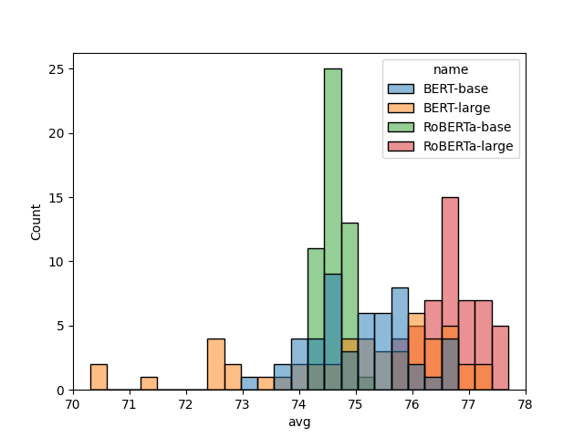
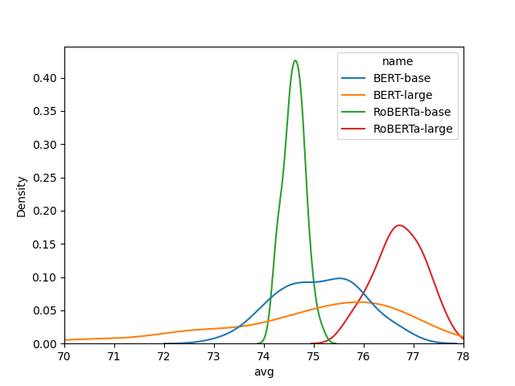
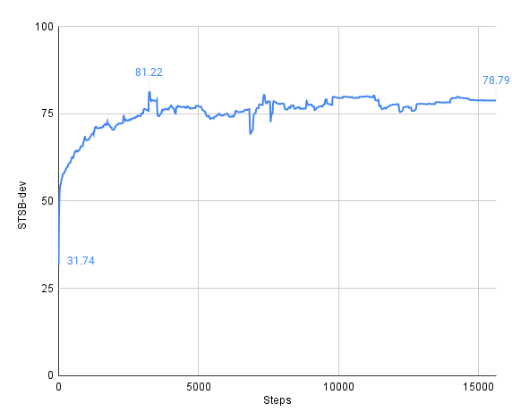
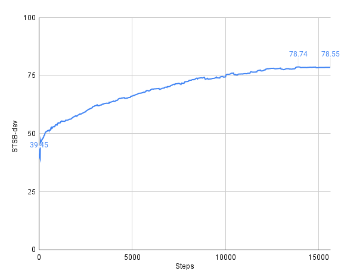
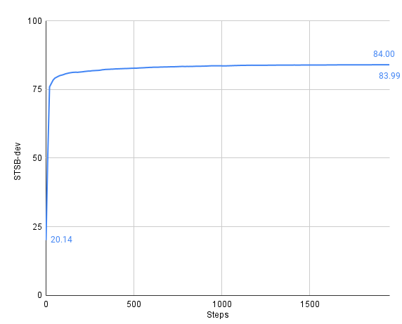

# Simple-SimCSE: A simple implementation of SimCSE

## Introduction

[SimCSE](https://aclanthology.org/2021.emnlp-main.552/) is one of the most exciting sentence embedding method using contrastive learning.
SimCSE achived state of the art performance, and advance representation learning in NLP greatly.

The concept of SimCSE is very simple in itself (as the title suggests).
However, [the official implementation of SimCSE](https://github.com/princeton-nlp/SimCSE) is abstracted to accommodate a variety of use cases, making the code a bit harder to read.

Of course, the official implementation is great.
However, a simpler implementation would be more helpful in understanding, in particular, it is important for those who are new to research about deep learning or who are just starting out with research about sentence embedding.

Therefore, We implemented a simple version of SimCSE, with minimal abstraction and use of external libraries.

Using some basic features of [PyTorch](https://github.com/pytorch/pytorch) and [transformers](https://github.com/huggingface/transformers), we developed code to perform fine-tuning and evaluation of SimCSE from scratch.

## Instllation & Training

For development, We used [poetry](https://python-poetry.org/), which is the dependency management and packaging tool for Python.

If you use poetry, you can install necessary packages by following command.

```bash
poetry install
```

Or, you can install them using `requiments.txt`.

```bash
pip install -r requirements.txt
```

The `requirements.txt` is output by following command.

```bash
poetry export -f requirements.txt --output requirements.txt
```

Then, you must execute `download.sh` to download training and evaluation datasets beforehand.
`download.sh` will collect STS and training datasets used in the paper in parallel.

```bash
bash download.sh
```

Finaly, you can train your model as below.

```bash
poetry run python train.py

# or
# python train.py
```


## Evaluation (Unsup-SimCSE)

In doing this implementation, we investigated how well the Unsup-SimCSE model trained by this implementation would perform.

We performed fine-tuning of Unsup-SimCSE **50 times** with different random seeds ([0, 49]) with the same dataset and hyperparameters as described in the paper (see `train-original.sh` and `train-multiple.sh`).
We evaluated them on 7 STS tasks (STS12--16, STS Benchmark, SICK-R).

We evaluated models every 250 training steps on the development set of STS-B and keep the best checkpoint for the final evaluation (as with the original paper, described in Appendix A).

### Overall


The table below shows the average performances on each STS task over 50 runs.

|               | STS12     | STS13     | STS14     | STS15     | STS16     | STS-B     | SICK-R    | Avg.      |
| ------------- | --------- | --------- | --------- | --------- | --------- | --------- | --------- | --------- |
| BERT-base     | **67.64** | 80.42     | 72.68     | 80.25     | 78.12     | 76.28     | 70.35     | 75.11     |
| BERT-large    | 65.83     | 80.44     | 71.60     | 81.45     | 76.85     | 75.96     | **72.52** | 74.95     |
| RoBERTa-base  | 64.92     | 80.06     | 71.52     | 79.92     | 78.73     | 78.67     | 68.39     | 74.60     |
| RoBERTa-large | 66.46     | **81.93** | **73.93** | **82.71** | **80.58** | **80.57** | 70.82     | **76.71** |

Overall, RoBERTa-large achieved the best average performance, however, the performance of all models compared poorly with the performance of the paper (see Table 5).

The reason is not clear, but the following two points are possible

- There is something wrong with our implementation.
- The hyperparameters used in the paper are tuned with a single random seed (see https://github.com/princeton-nlp/SimCSE/issues/63), so the hyperparameters are not good for our implementation.
  - In that case, it would be very difficult to perfectly reproduce the performance of SimCSE with different implementations.


We also found that SimCSE is a bit sensitive to random seeds.
The following figures show histograms and KDE plots of average performance for each fine-tuning.



BERT-base and BERT-large show a larger variance in performance compared to RoBERTa-base and RoBERTa-large.

There are many possible reasons for this difference, but the most likely cause is a difference in batch size.

BERT-base and BERT-large are fine-tuned with batch size 64, however, RoBERTa-base and RoBERTa-large are fine-tuned with batch size 512.

We suspect that using smaller batch sizes is likely to result in more unstable performance.


### Details

To encourage future research, we show the average, maximum, and minimum performance for each model for each STS task.

The results of all experiments for each model are in the `results` directory, so we hope they help you.

In addition, to investigate how the performance of each model changes during training, we show the performance transition the development set of STS Benchmark.


#### BERT-base

|      | STS12 | STS13 | STS14 | STS15 | STS16 | STS-B | SICK-R | Avg.  |
| ---- | ----- | ----- | ----- | ----- | ----- | ----- | ------ | ----- |
| min  | 64.64 | 77.91 | 69.36 | 77.60 | 76.26 | 73.99 | 67.80  | 73.16 |
| mean | 67.64 | 80.42 | 72.68 | 80.25 | 78.12 | 76.28 | 70.35  | 75.11 |
| max  | 70.24 | 82.89 | 74.93 | 82.80 | 79.95 | 78.29 | 71.99  | 76.70 |




The performance of BERT-base is a bit unstable.
This is thought to be largely due to batch size.

On the other hand, it is also worth noting that BERT-base achieved the best performance on STS12.


#### BERT-large

|      | STS12 | STS13 | STS14 | STS15 | STS16 | STS-B | SICK-R | Avg.  |
| ---- | ----- | ----- | ----- | ----- | ----- | ----- | ------ | ----- |
| min  | 61.00 | 73.62 | 65.20 | 76.37 | 69.35 | 69.26 | 67.58  | 70.31 |
| mean | 65.83 | 80.44 | 71.60 | 81.45 | 76.85 | 75.96 | 72.52  | 74.95 |
| max  | 69.12 | 84.39 | 75.18 | 83.63 | 79.34 | 79.10 | 75.15  | 77.28 |





BERT-large has the most unstable performance of all models (min=70.31, max=77.28).
However, the performance transition seems to be much more stable than BERT-base.

Furthermore, BERT-large achieved the highest performance on SICK-R.


#### RoBERTa-base

|      | STS12 | STS13 | STS14 | STS15 | STS16 | STS-B | SICK-R | Avg.  |
| ---- | ----- | ----- | ----- | ----- | ----- | ----- | ------ | ----- |
| min  | 63.64 | 79.28 | 70.92 | 79.09 | 78.22 | 78.04 | 67.17  | 74.17 |
| mean | 64.92 | 80.06 | 71.52 | 79.92 | 78.73 | 78.67 | 68.39  | 74.60 |
| max  | 66.17 | 81.18 | 72.32 | 80.60 | 79.40 | 79.41 | 69.15  | 75.14 |


The performance of RoBERTa-base is stable.

The large batch size should be at a slight disadvantage because of the small number of evaluation steps, but RoBERTa-base achieved relatively high performance.


#### RoBERTa-large

|      | STS12 | STS13 | STS14 | STS15 | STS16 | STS-B | SICK-R | Avg.  |
| ---- | ----- | ----- | ----- | ----- | ----- | ----- | ------ | ----- |
| min  | 63.94 | 80.63 | 72.62 | 81.57 | 79.53 | 78.54 | 68.19  | 75.64 |
| mean | 66.46 | 81.93 | 73.93 | 82.71 | 80.58 | 80.57 | 70.82  | 76.71 |
| max  | 68.17 | 83.54 | 75.17 | 84.03 | 81.33 | 81.91 | 72.38  | 77.69 |




RoBERTa-large achieved the best overall performance and performance changes were stable.

As can be seen from the performance transition between BERT-large and RoBERTa-large, there is a fairly significant difference between the two models.

Whether this is due to hyperparameters or differences in pre-training data/tasks is a matter for further research.


## In this work

SimCSE has further advanced research of sentence embeddings.
The clarity of SimCSE is very impressive, and wide range of applications will be developed in the future.

We hope that this implementation will help in understanding and facilitate future research.


## Citation

Author: [Hayato Tsukagoshi](https://hpprc.dev)

If you would like to collaborate with me, please feel free to contact me at the email address below.

[research.tsukagoshi.hayato@gmail.com](mailto:research.tsukagoshi.hayato@gmail.com)


```bibtex
@misc{
  hayato-tsukagoshi-2022-simple-simcse,
  author = {Hayato Tsukagoshi},
  title = {Simple-SimCSE: A simple implementation of SimCSE},
  year = {2022},
  publisher = {GitHub},
  journal = {GitHub repository},
  howpublished = {\url{https://github.com/hppRC/simple-simcse}}
}
```